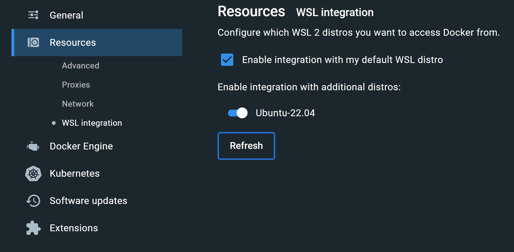

# Environment Setup 

This document will help you install and familiarize yourself with the necessary software and tools for developing your own autonomous driving algorithms. 

By the end of this document, you will have:
1. Installed Ubuntu
2. Installed Duckietown dependencies and the shell
3. Learned about the terminal
4. Installed Python and some required modules
5. Tested your Python installation with a basic script

## Operating System Setup

The Duckietown ecosystem is based upon a flavour of the [Linux operating system](https://www.linux.com/what-is-linux/) called [Ubuntu](https://ubuntu.com/desktop). 
Officially, Duckietown only supports Ubuntu Linux distributions and has unofficial support for MacOS, but does not support Windows natively 
(see this [page](https://docs.duckietown.com/daffy/opmanual-duckiebot/setup/setup_laptop/index.html) for more information).

Depending on the computer and the operating system (OS) that you have, you have a number of options for running Ubuntu on your machine. 
<ol>
  <li>You can install Ubuntu as the only OS on your machine.</li>
  <li>You can install Ubuntu OS alongside your other operating system - i.e., you will have two OSes that you will have to select between when booting up your machine. This is known as "dual-booting"</li>
  <li>You can install a piece of software called a virtual machine (VM) that provides a virtual computer that exists in software on top of your host machine and install Ubuntu on that VM.</li>
  <li>If you have Windows 11 on your Laptop, you can install a program called Windows Subsystem for Linux (WSL), a lightweight VM developed by Microsoft for hosting Linux OSs.</li>
</ol>
   
We provide guidance on what we believe are the relatively easier and less risky options (3 and 4) below. 

<table>
  <tr>
    <th>OS Setup</th>
    <th>Pros</th>
    <th>Cons</th>
    <th>Use this OS setup if you:</th>
  </tr>
  <tr>
    <td>Install Ubuntu on a Virtual Machine</td>
    <td>
      <ul>
        <li>Installation is relatively easy.</li>
        <li>If something goes wrong in the guest OS (Ubuntu), it won't affect the host OS (Windows or MacOS).</li>
        <li>Very little chance of putting existing data on your machine at risk.</li>
        <li>Can work on Ubuntu and Windows/MacOS without needing a reboot.</li>
      </ul>
    </td>
    <td>
      <ul>
        <li>Performance of the OS on the VM will be limited.</li>
        <li>Some hardware or software might not work correctly on the guest operating system.</li>
      </ul>
    </td>
    <td>
      <ul>
        <li>Are using a Windows or Mac computer and prefer not risking your operating system and data.</li>
      </ul>
    </td>
  </tr>
  <tr>
    <td>Install Ubuntu through Windows Subsystem for Linux (WSL)</td>
    <td>
      <ul>
        <li>Much easier to setup than any of the other options.</li>
        <li>Same benefits as installing Ubuntu on VM.</li>
      </ul>
    </td>
    <td>
      <ul>
        <li>Performance of Ubuntu on WSL may be limited.</li>
        <li>Host OS data will be exposed to Ubuntu (you can modify files in Windows through Ubuntu).</li>
        <li>Only works with Windows 11.</li>
        <li>Some hardware or software might not work correctly that otherwise would on a VM.</li>
        <li>Difficult to get a desktop environment (graphical user interface) up and running.</li>
      </ul>
    </td>
    <td>
      <ul>
        <li>Have a machine running Windows 11.</li>
        <li>Installing Ubuntu alongside Windows is too risky for you.</li>
        <li>Are OK with having to deal with not having a graphical user interface GUI or spending more time to set one up.</li>
        <li>Have other members of your team that have installed Ubuntu using the other options above.</li>
      </ul>
    </td>
  </tr>
</table>

> [!IMPORTANT]
> We recommend a VM solution. We anticipate you will find it much easier to proceed in the course with a VM.

### Install Ubuntu on a Virtual Machine (VM)

A virtual machine (VM) is a computer file, typically called an image, that behaves like an actual computer and emulates a physical machine complete with CPU, memory, disks to store your files, 
and can connect to the internet if needed. 
To install Ubuntu on a VM, we need to install VM software, use it to create a VM, and install Ubuntu on that VM. 
The instructions below summarize how to perform these tasks, and summarize more detailed instructions that can be found 
[here](https://ubuntu.com/tutorials/how-to-run-ubuntu-desktop-on-a-virtual-machine-using-virtualbox#1-overview).

- [ ] Check that your disk has enough free space (>60 GB). You can do this by going to the Start Menu, and searching for 'Storage Settings'.
Open the Storage Settings application, which will show you how much space you have left on your disk drive.

- [ ] There are several VM applications out there. We recommend using the freely available VMWare Workstation Player.
Download VMWare Workstation Player 17 from [here](https://www.vmware.com/ca/products/workstation-player.html) and install it on your machine.

- [ ] Download the [Ubuntu 22.04.3 LTS](https://ubuntu.com/download/desktop) .iso distribution image.
    
- [ ] Once installed, open VMWare Workstation Player and click `Player -> File -> New Virtual Machine (Ctrl + N)` to create a new VM. Populate the Installer dick image file (iso) field-box in the open window with the link to the ISO you downloaded from the Ubuntu website.

- [ ] On the next page, populate your username and password that will give you secure access to the virtual machine.
- [ ] On the next page, give your virtual machine a name.

- [ ] On the next couple of screens, we can specify how much of our host (i.e., Windows) machine’s memory and processors the VM can use, in addition to creating a virtual disk file.
<ul>
<li>For good performance, Try to remain above the recommendations to prevent issues with your machine running both the VM and the host OS.</li>
<li>It’s recommended to provide your VM with around 8GB of RAM (although 4GB will still be usable) and 4 CPUs if possible.</li>
<li>We recommend you allocate 60 GB or more of disk space for the virtual machine. By default the hard disk will scale dynamically as more memory is required up to the defined limit 
  (i.e., your VM file will not initially take up the amount of space that you allocate it, but it will dynamically grow as you add files to the virtual disk). 
  </li>
</ul>

- [ ] On the next page, you will see a configuration summary of your VM. Ensure the details are correct and click `Finish`.

- [ ] After the installation, you can navigate to the virtual machine and Click 'Play virtual machine' to launch the virtual machine. 
Once the installation completes, the VM will automatically reboot to complete the installation. 
Finally, you will be greeted with the Ubuntu log-in screen where you can enter your username and password defined during the initial setup.

- [ ] Once you’ve finished your session on your VM you can close your VM by clicking the shot-down button. 
in the top right of the window and choosing whether to keep your machine frozen in its current state (Suspend) or shut it down completely (Power Off).

### Install Ubuntu on Windows Subsystem for Linux 2 (WSL)

You can think of Windows Subsystem for Linux (WSL) as a very lightweight VM that is a feature within Windows 11. 
However, unlike a fully-fledged VM, you will not have a graphical user interface (GUI) or a desktop environment that uses the mouse by default; 
all of your interactions with Ubuntu will be through a text-only terminal.

The following steps will guide you through the installation of Ubuntu on WSL. For more guidance on installing WSL, refer to <https://learn.microsoft.com/en-us/windows/wsl/install>.

- [ ] Install WSL by first running the Window's command prompt **as administrator**. To do this, click on the Windows `Start` button on your taskbar, and type `cmd`. 
The first search option will be `Command Prompt`. On the right-hand side of the start menu, select `Run as administrator`. 

Enter <code>wsl --install</code>, then restart your machine.        

- [ ] Install Ubuntu 22.04 LTS.
Once your machine has been restarted, open the command prompt again, and enter the command:
<code>wsl --install -d Ubuntu-22.04</code>

- [ ] Update WSL and the Linux distribution to WSL 2.

Enter <code>wsl --update</code>
Enter <code>wsl --set-version Ubuntu-22.04 2</code>

- [ ] Set the Ubuntu-22.04 as your default WSL distribution.

Enter <code>wsl --set-default Ubuntu-22.04</code>

- [ ] You can now access the Ubuntu/Linux command line (aka shell) on your Windows Command Prompt by entering `wsl` where you can execute Linux-specific instructions. 
To exit from the Ubuntu shell, enter: `exit`. Anytime you want to use Ubuntu, you can start up the Windows Command Prompt and type `wsl`. 
Alternatively, Windows comes bundled with another flavour of command prompt called `PowerShell` where you can similarly call `wsl`. 

Note that you will not need to run these command prompts as administrator again after installation. All the remaining instructions/commands in later sections are Linux shell-specific. 

## The Command Line

In this class, we will be making extensive use of the command line interface (CLI), which is also known as the terminal (we will be using these terms interchangeably). 
The command line is perhaps a foreign concept to many of you as it does not have graphical elements; there are no icons, context menus, desktops and windows. 
Instead, it is simply a dark screen, a line that displays your `your-username@your-machinename:` and a blinking cursor ready to accept typed text.

Although the terminal looks simple, it is actually an incredibly powerful tool central to working on Linux-based systems where commands are written out on the prompt that is executed by the computer. 
However, to be able to wield that power, it is critical that you understand the syntax and basic commands used to perform operations within the terminal. 

To begin, let's bring up a command line interface. 
For those of you who have access to a GUI desktop within Ubuntu, you can bring up the terminal by navigating to Ubuntu's start menu on the bottom left-hand corner of the screen and selecting the `Terminal` application. 
Alternatively, you can use the keyboard shortcut `CTRL+ALT+T`. If you are using Ubuntu on WSL, open a Windows Command Prompt or Powershell, and enter `wsl`. Now you are ready for the next activity. 

> [!tip]
> Go through the command line tutorial provided by Canonical (the company that created and backs Ubuntu) found here: <https://ubuntu.com/tutorials/command-line-for-beginners>
>
> Be able to understand how to perform the following options from the terminal:
>
> - [ ] Print your current working directory
>      
> - [ ] Change the current working directories relative to your home and current directories 
>
> - [ ] List items in your current directory
>
> - [ ] Make a new directory
>
> - [ ] Create, edit, and read a text file
>
> - [ ] Move files and directories
>
> - [ ] Deleting files and directories (and understand why it is not a great idea to use the command \code{rm -rf})
>
> - [ ] Look up arguments that are available for a command and how to use that command
>
> - [ ] Install a new application with appropriate permissions (and understand why it is never a good idea to give someone root permissions)

> One thing to note: when you are typing passwords in the terminal (e.g., after entering a command involving `sudo`),
> there will be no indication that you have entered any characters; your cursor will not advance, and no password characters that you have typed will be shown.
> This is normal behaviour. If you know you have typed your password incorrectly, you can either knowingly press `Enter` and retry or press the `Backspace` key many
> times to delete the erroneous password and try entering it again. 

## Installing Duckietown Dependencies

The Duckietown ecosystem depends on several other pieces of software that must be installed. 
To guide you through the installation of such software, follow the instructions in the Duckiebot Operation Manual found here: <https://docs.duckietown.com/daffy/opmanual-duckiebot/setup/setup_laptop/index.html>. 
Follow instructions for both the [Setup - Laptop](https://docs.duckietown.com/daffy/opmanual-duckiebot/setup/setup_laptop/index.html) 
and [Setup - Accounts](https://docs.duckietown.com/daffy/opmanual-duckiebot/setup/setup_account/index.html)

> [!warning]
> Be sure to select the correct set of instructions on the Duckiebot Operation Manual according to your Ubuntu installation method. The manual has three options: 
>
> <ul>
>  <li>Ubuntu - these instructions apply to native Ubuntu installations (i.e., Ubuntu as the only OS on your machine or Ubuntu installed alongside Windows) and Ubuntu installed on VM.</li>
>  <li>MacOS - these instructions apply to MacOS installations that are unsupported in the course.</li>
>  <li>Windows (Beta) - these instructions apply to Windows Subsystem for Linux installations of Ubuntu.</li>
> </ul>
>
> Follow the instructions in the following link closely, ensuring all the validation tests are run. You only need to complete the instructions under the `Setup: Laptop` and `Setup: Accounts` sections.

Here, we provide additional guidance and troubleshooting for known issues during Duckietown dependency installation.

> [!tip]
> **Problem:** You get an error when running `docker run hello-world`.
>
> If you are using WSL, you need to install Docker Desktop on Windows.
> Follow the instructions here: <https://docs.duckietown.com/daffy/opmanual-duckiebot/setup/setup_laptop/setup_docker.html>.
> Additionally, you are required to perform the following steps in Docker Desktop:
>
> - [ ] Access `Settings > General` and check :heavy_check_mark: `Use the WSL 2 based engine`.
> - [ ] Access `Settings > Resources > WSL integration` and check :heavy_check_mark: `Enable integration with my default WSL distro` and `Ubuntu-22.04` under `Enable integration with additional distros:`.
> - [ ] Apply and restart.

> [!tip]
> **Problem:** If you obtain an error:
> <code>docker: permission denied while trying to connect to the Docker daemon socket</code>,
> you can fix this issue by running Docker as a non-root user and adding yourself to the docker group.
>
> To do this, we will follow the instructions located [here](https://docs.docker.com/engine/install/linux-postinstall/#manage-docker-as-a-non-root-user) and summarized below.
>> :heavy_exclamation_mark: Note that the following grants privileges equivalent to the root user. For details on how this impacts security in your system, see Docker
>> [Daemon Attack Surface](https://docs.docker.com/engine/security/#docker-daemon-attack-surface).
>
> - [ ] Create the Docker group (if it does not exist).
> Enter `sudo groupadd docker`
> - [ ] Add your user to the docker group.
> Enter `sudo usermod -aG docker <yourlinuxname>`
> - [ ] Log in to the new docker group.
> Enter `newgrp docker`
> - [ ] Check if docker can be run without root.
> Enter `docker run hello-world`
> - [ ] Optionally, reboot if you still get the error.
> Enter `reboot`

> [!tip]
> **Problem:** `which dts` does not run after installing the Duckietown Shell (dts).
>
> If you cannot successfully run `which dts` after installing the duckietown-shell, close and restart your Linux shell and try again.

## Python Installation

Duckietown is primarily developed in Python, and we will be coding in Python. This section will help guide you in installing the required tools that will facilitate your practice of Python.

### Install/Upgrade Python
Python should come pre-installed in Ubuntu. To check that it is on your system, open a terminal window and enter: `python3`. If Python is not found, run the command: 

`sudo apt install python3`

You should have version 3.10.6 or later. If not, run the following command:

`sudo apt --only-upgrade install python3`

If you are new to Python, there are many online tutorials that you can learn Python with. 
We recommend <https://www.learnpython.org/>, but we also encourage you to find one which you like best and spend some time coding a few exercises to familiarize yourself with the language.

### Install PIP
PIP is a package manager for Python packages/modules. PIP is to Python like `apt` is to Ubuntu. 
You can use PIP to install Python modules (which we will be doing in the next section). In your terminal, install PIP using the command:

`sudo apt install python3-pip`

### Install Python Modules
There are some core Python modules that should be installed as part of this course. They can simply be installed using the following command in the terminal (only after PIP is installed):

`pip install numpy scipy matplotlib notebook opencv-python`

This command will install the following Python modules:
<ul>
<li>NumPy `numpy` is an open-source Python library used in almost every field of science and engineering for numerical data crunching and processing. 
  NumPy has structures to represent multidimensional arrays and matrix structures useful analysis. 
  Other libraries use and depend on NumPy. We recommend you at least understand the basics of NumPy by going through the crash course here: <https://numpy.org/doc/stable/user/absolute_beginners.html>
<li>SciPy `scipy` is a collection of mathematical algorithms and convenience functions built on NumPy. 
  It adds significant power to the interactive Python session by providing high-level commands and classes for manipulating and visualizing data.
<li>Matplotlib `matplotlib` is a comprehensive library for creating static, animated, and interactive visualizations in Python.
<li>Jupyter Notebook `notebook` is an interactive web-based development environment that operates in a 'notebook' fashion where code and outputs are integrated into a single document. 
  This document is a great way of running and showcasing code, visualizations, narrative text, equations, and other rich media formats. We'll be using notebooks extensively in this course. 
  You can open Jupyter by entering the following command into the terminal: \code{jupyter notebook}. A brief tutorial on using Jupyter notebooks can be found here: <https://realpython.com/jupyter-notebook-introduction/>.
<li>OpenCV `opencv-python` is an open-source library with hundreds of computer vision algorithms. It is originally coded in C/C++, but we'll be using the Python library for this course. 
</ul>

### Integrated Development Environment (IDE)

There are many different integrated development environments (IDE) out there available for you to use. We recommend two in this course: Pycharm and VS Code. 
Both are available on Ubuntu and Windows. 

> You only need to install one IDE. You do not need to install both.

#### Install Jetbrains Pycharm
If this is the first time you will be using Python, we recommend downloading and installing JetBrains Pycharm Community Edition IDE, which is free to use. 
In Ubuntu, you can download Pycharm directly through the Ubuntu Software Center. 
You can alternatively download it for Ubuntu by following the instructions in this link: <https://www.jetbrains.com/pycharm/download/>

> [!tip]
> Students get free access to the Pro Edition of Pycharm through this link: <https://www.jetbrains.com/community/education/#students>

You can learn about how to use PyCharm using the "Learn IDE Features" interactive course, under the Learn item in the "Welcome to PyCharm" screen upon startup. 

#### Visual Studio Code

If you are a bit more familiar with Python and coding in general, you may wish to try an IDE that quickly becoming the standard in the software industry. 
Visual Studio Code (aka VS Code) is a flexible development environment that isn't exactly an IDE (it isn't bundled with a compiler), but feels like one given the number of extensions that you can use with VS Code. 

- [ ] Install VS Code through Ubuntu's Software Centre or download VS Code here: <https://code.visualstudio.com/download> from within Ubuntu.
- [ ] Within VS Code, install the Python extension.

> [!tip]
> If you are using Ubuntu through WSL, it is recommended that you use VS Code on Windows as Microsoft provides a WSL extension that allows you to develop within Ubuntu,
> use Linux-specific toolchains and utilities, and run and debug your Linux-based applications from VS Code on Windows.
> For more information on how this works, see <https://code.visualstudio.com/docs/remote/wsl>.

> [!warning]
> Fair warning: it will take a bit of effort to get set up with VS Code compared to Pycharm. If you want to get started quickly without hassle, install Pycharm.

Spend some time familiarizing yourself with the IDE. A series of excellent beginner videos on how to use VS code can be found here: <https://code.visualstudio.com/docs/introvideos/basics>

> **Compiling Your First OpenCV Program**
> Now that we have Ubuntu, Python and required modules set up, let's go ahead and test our setup by creating our first OpenCV python script. 
>
> In this activity, you will test your installation of Python and required modules. 
>
> - [ ] Open up your Python IDE of choice and enter the following script in a new file named `test\char_cv2.py`
> 
>       import cv2
>       from matplotlib import pyplot as plt
>       img = cv2.imread('programmers_credo.jpg',cv2.IMREAD_GRAYSCALE)
>       plt.imshow(img, cmap = 'gray', interpolation = 'bicubic')
>       plt.plot([150,250,350],[350,360,380],'c', linewidth=5)
>       plt.show()
>
> - [ ] Download the image file `programmers_credo.jpg` from this Setup GitHub repository and save it in the same folder as the Python script file you created above.
> 
> - [ ] Run the script and ensure you get an expected output.

> [!tip]
> **Further Guidance for WSL/VSCode users to complete the above Python activity**
> 
> After you have finished installing WSL and VSCode on Microsoft.
> 1) If you cannot import openCV
> For example, due to an error like so: "libGL.so.1: cannot open shared object file: No such file or directory".
> In the Linux terminal, input
> 
>         sudo apt-get update
>         sudo apt-get install -y python3-opencv 
>
>         pip install opencv-python
> 
> This install further dependencies that are not being automatically installed when you try to install opencv.
> 
> This comes courtesy from [here](https://itsmycode.com/importerror-libgl-so-1-cannot-open-shared-object-file-no-such-file-or-directory/)
> 
> Next, after you follow the instructions to pair your VSCode with WSL on <https://code.visualstudio.com/docs/remote/wsl>
> 
> 2) If you cannot plot the jpg
> 
> Install a backend GUI in the Linux terminal. The following install tkinter.
> 
>         sudo apt-get install python3-tk
>
> Next, type the following in your Python file header and run on VSCode again.
> 
>         import matplotlib
>         matplotlib.use('TkAgg')
>         import matplotlib.pyplot as plt
